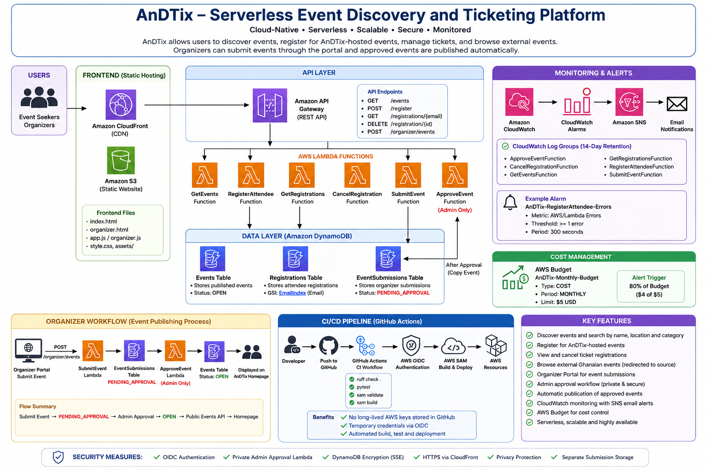

# AnDTix – Serverless Event Discovery and Ticketing Platform

AnDTix is a cloud-native event discovery, registration and organizer event-listing platform built on AWS.

It demonstrates how serverless AWS services, Infrastructure as Code, CI/CD, monitoring, security controls and cost management can be combined to build and operate a modern event platform.

AnDTix was developed as an **AWS Cloud Computing Capstone Project**.

---

## 🌐 Live Application

### Live Website

**https://d1ikp9n3ouohir.cloudfront.net/**

The frontend is hosted on Amazon S3 and delivered securely through Amazon CloudFront.

### Live API

**https://1y36equfk9.execute-api.us-east-1.amazonaws.com**

Example:

```text
GET https://1y36equfk9.execute-api.us-east-1.amazonaws.com/events
```

> The API Gateway base URL does not define a `/` route. Use one of the application routes such as `/events`, `/register` or `/organizer/events`.

---

## 📌 Project Overview

AnDTix provides one platform for attendees to discover events and for organizers to submit events for publication.

### Attendees can:

- Discover upcoming events
- Search events by name
- Search events by location
- Browse events by category
- View native AnDTix events
- View selected external Ghanaian event listings
- Register for AnDTix-hosted events
- Retrieve existing registrations
- Cancel registrations

### Event organizers can:

- Access the Organizer Portal
- Enter organizer details
- Submit event information
- Choose free or paid event options
- Set ticket price and capacity
- Select standard or featured listing
- Submit events for administrative review
- Have approved events published to the public platform

### Platform operations include:

- Automated CI/CD with GitHub Actions
- AWS OIDC authentication
- CloudWatch logging
- CloudWatch error monitoring
- Amazon SNS email notifications
- AWS Budget monitoring
- 14-day CloudWatch log retention

---

## 🏗️ AWS Architecture



### High-Level Architecture

```text
Users
  |
  v
Amazon CloudFront
  |
  v
Amazon S3
Static Frontend
  |
  v
Amazon API Gateway
  |
  v
AWS Lambda
  |
  v
Amazon DynamoDB
```

Additional operational services include:

```text
GitHub
   |
   v
GitHub Actions
   |
   v
AWS OIDC
   |
   v
AWS SAM Deployment
```

and:

```text
AWS Lambda
    |
    v
Amazon CloudWatch
    |
    v
CloudWatch Alarm
    |
    v
Amazon SNS
    |
    v
Email Notification
```

---

# ✨ Core Features

## 1. Event Discovery

Visitors can browse events available through AnDTix.

Event cards can display:

- Event name
- Description
- Location
- Date and time
- Category
- Capacity
- Event status
- Listing type

---

## 2. Event Search

The homepage supports searching by:

- Event name
- Location
- Event information

This allows visitors to find relevant events more quickly.

---

## 3. Event Categories

Events can be browsed using categories such as:

- Music
- Technology
- Business
- Arts
- Sports
- Lifestyle

---

## 4. Native AnDTix Events

Native events can be registered for directly through AnDTix.

Typical public event status:

```text
OPEN
```

Users can select the event and complete the registration form.

---

## 5. External Event Listings

AnDTix also displays selected external Ghanaian events.

External listings are clearly identified as:

```text
EXTERNAL EVENT
```

Users are redirected to the original event source instead of registering through AnDTix.

This keeps third-party events separate from native AnDTix registrations.

---

## 6. Event Registration

Users can register for supported events using:

- Event
- Full name
- Email address

Registration requests are processed by AWS Lambda and stored in Amazon DynamoDB.

---

## 7. My Tickets

Users can retrieve existing registrations using their email address.

The application queries the registration database and displays matching registration information.

---

## 8. Ticket Cancellation

Users can cancel an existing registration.

A dedicated Lambda function handles the cancellation request and updates the registration record.

---

# 🏢 Organizer Portal

AnDTix includes a dedicated Organizer Portal for event submissions.

The portal is available from the live website through the **List Your Event** option.

Organizer submissions collect:

### Organizer Details

- Organizer/company name
- Contact person
- Email address
- Phone number

### Event Details

- Event name
- Description
- Category
- Venue
- City
- Country
- Event date
- Start time

### Ticketing

- Free or paid event
- Ticket price
- Event capacity

### Promotion

- Standard listing
- Featured promotion

---

## Organizer Submission Status

New organizer submissions are not immediately displayed publicly.

They are first stored with:

```text
PENDING_APPROVAL
```

This provides a controlled publishing process.

---

# 🔐 Organizer Approval Workflow

The complete event publishing workflow is:

```text
Organizer Portal
      |
      v
POST /organizer/events
      |
      v
Amazon API Gateway
      |
      v
SubmitEvent Lambda
      |
      v
EventSubmissions Table
      |
      v
PENDING_APPROVAL
      |
      v
Private ApproveEvent Lambda
      |
      v
Events Table
      |
      v
OPEN
      |
      v
Public Events API
      |
      v
AnDTix Homepage
```

The approval Lambda is intentionally **not exposed through a public API endpoint**.

Administrative approval is performed through authenticated AWS access.

This prevents public users from approving their own submissions.

---

## ✅ Verified Live Organizer Workflow

The complete organizer workflow was tested successfully using the deployed platform:

```text
Live Organizer Portal
        ↓
Submit Event
        ↓
EventSubmissions DynamoDB Table
        ↓
PENDING_APPROVAL
        ↓
Private Admin Approval
        ↓
Events DynamoDB Table
        ↓
OPEN
        ↓
GET /events
        ↓
Live AnDTix Homepage
```

The approved test event successfully appeared on the live public website.

---

# ☁️ AWS Services Used

## Amazon CloudFront

CloudFront provides the public HTTPS distribution for the AnDTix frontend.

Live website:

```text
https://d1ikp9n3ouohir.cloudfront.net/
```

Benefits include:

- HTTPS delivery
- Edge content distribution
- S3 frontend delivery
- Cache management
- Improved frontend performance

---

## Amazon S3

Amazon S3 stores the static frontend application.

Main frontend structure:

```text
frontend/
├── assets/
│   └── dennis-antwi.jpg
├── index.html
├── organizer.html
├── app.js
├── organizer.js
└── style.css
```

---

## Amazon API Gateway

Amazon API Gateway provides the HTTP API used by the frontend.

### Current Routes

| Method | Route | Purpose |
|---|---|---|
| GET | `/events` | Retrieve public events |
| POST | `/register` | Register an attendee |
| GET | `/registrations/{email}` | Retrieve registrations |
| DELETE | `/registration/{id}` | Cancel a registration |
| POST | `/organizer/events` | Submit an organizer event |

The private event approval Lambda does not have a public API route.

---

# ⚡ AWS Lambda Functions

The backend currently contains six Lambda functions.

```text
GetEventsFunction
RegisterAttendeeFunction
GetRegistrationsFunction
CancelRegistrationFunction
SubmitEventFunction
ApproveEventFunction
```

## GetEventsFunction

Retrieves public events from the Events DynamoDB table.

## RegisterAttendeeFunction

Processes attendee registrations and stores registration information.

## GetRegistrationsFunction

Retrieves registrations associated with an email address.

## CancelRegistrationFunction

Processes registration cancellation requests.

## SubmitEventFunction

Receives Organizer Portal submissions and stores them as pending events.

## ApproveEventFunction

Privately approves organizer submissions and publishes approved events.

---

# 🗄️ Amazon DynamoDB

AnDTix uses separate DynamoDB tables for different workloads.

## Events Table

Stores publicly available events.

Example status:

```text
OPEN
```

---

## Registrations Table

Stores attendee registration records.

The table includes an:

```text
EmailIndex
```

Global Secondary Index.

This supports retrieving registrations by attendee email.

---

## EventSubmissions Table

Stores organizer submissions before publication.

Initial status:

```text
PENDING_APPROVAL
```

After approval, an event is published into the Events table.

---

# 🎨 Frontend

The frontend is built using:

```text
HTML
CSS
JavaScript
```

### Main Pages

```text
frontend/index.html
frontend/organizer.html
```

### JavaScript

```text
frontend/app.js
frontend/organizer.js
```

### Styling

```text
frontend/style.css
```

---

## Homepage Experience

The current live homepage includes:

- Sticky navigation
- Modern event discovery hero
- Event search
- Category browsing
- Featured event display
- Native event cards
- External event listings
- Registration section
- My Tickets lookup
- Organizer promotion section
- Serverless AWS technology section
- Founder section
- Call-to-action section
- Responsive footer

---

# 💳 Payment-Ready Design

The Organizer Portal includes interface elements for future payment support.

The design references payment methods such as:

- Mobile Money
- Visa
- Mastercard
- Payment gateway integration

However:

> **Live payment processing has not yet been implemented.**

Payment gateway integration remains a future production enhancement.

---

# 🚀 CI/CD Pipeline

AnDTix uses GitHub Actions for Continuous Integration and Continuous Deployment.

Workflow files:

```text
.github/workflows/ci.yml
.github/workflows/deploy.yml
```

---

## Continuous Integration

The CI workflow performs automated checks including:

```bash
ruff check .
pytest
sam validate
sam build
```

These checks help identify:

- Python code quality problems
- Unit test failures
- Invalid SAM templates
- Build problems

---

## Continuous Deployment

Changes pushed to the `main` branch trigger automated AWS deployment.

```text
Developer
    |
    v
Git Push
    |
    v
GitHub
    |
    v
GitHub Actions
    |
    v
AWS OIDC Authentication
    |
    v
AWS SAM
    |
    v
AWS Deployment
```

The final GitHub Actions runs were verified successfully for both:

```text
AnDTix CI
Deploy AnDTix to AWS
```

---

# 🔑 GitHub OIDC Authentication

GitHub Actions authenticates with AWS through OpenID Connect.

This avoids storing permanent AWS deployment access keys in GitHub.

Benefits include:

- Temporary AWS credentials
- No long-lived AWS access keys
- Improved deployment security
- IAM-controlled permissions
- Automated authentication

---

# 📊 Monitoring and Observability

Amazon CloudWatch is used to monitor the AnDTix Lambda environment.

CloudWatch log groups exist for:

```text
ApproveEventFunction
CancelRegistrationFunction
GetEventsFunction
GetRegistrationsFunction
RegisterAttendeeFunction
SubmitEventFunction
```

---

## CloudWatch Log Retention

All AnDTix Lambda log groups are configured with:

```text
14 days
```

retention.

This prevents log data from being retained indefinitely and helps control storage costs.

---

# 🚨 CloudWatch Error Alarm

An error alarm monitors the registration Lambda.

Alarm:

```text
AnDTix-RegisterAttendee-Errors
```

Configuration:

```text
Namespace: AWS/Lambda
Metric: Errors
Statistic: Sum
Period: 300 seconds
Evaluation Periods: 1
Threshold: >= 1
Treat Missing Data: notBreaching
```

The alarm was verified in:

```text
OK
```

state after configuration.

---

# 📧 Amazon SNS Alerts

The CloudWatch alarm is connected to an Amazon SNS topic:

```text
AnDTix-Alerts
```

Monitoring flow:

```text
RegisterAttendee Lambda
        |
        v
AWS/Lambda Error Metric
        |
        v
CloudWatch Alarm
        |
        v
Amazon SNS
        |
        v
Email Alert
```

The SNS configuration was tested successfully.

A real test email with the subject:

```text
AnDTix Monitoring Test
```

was successfully delivered.

---

# 💰 AWS Cost Monitoring

AnDTix includes AWS Budget monitoring.

Budget configuration:

| Setting | Value |
|---|---|
| Budget Name | `AnDTix-Monthly-Budget` |
| Type | COST |
| Period | MONTHLY |
| Limit | $5 USD |
| Alert Threshold | 80% |
| Alert Value | $4 |

The budget notification is configured to send an email when actual monthly AWS spending exceeds the configured threshold.

---

# 🛡️ Security Controls

The project includes several security measures.

## AWS OIDC

GitHub Actions uses temporary AWS credentials.

## Private Event Approval

The approval Lambda is not exposed publicly through API Gateway.

## DynamoDB Encryption

Server-side encryption is enabled for DynamoDB resources.

## HTTPS

The frontend is delivered through HTTPS using Amazon CloudFront.

## Separate Submission Storage

Pending organizer submissions are separated from public events.

## Organizer Privacy

Organizer contact information is stored in the submissions workflow and is not intentionally exposed through the public events API.

## Monitoring

CloudWatch provides operational visibility into Lambda activity.

## Cost Protection

AWS Budgets helps prevent unexpected cloud spending.

---

# 🧪 Testing

Automated tests are stored under:

```text
tests/
```

Current unit tests include:

```text
tests/unit/test_cancel_registration.py
tests/unit/test_get_events.py
tests/unit/test_get_registrations.py
tests/unit/test_register_attendee.py
```

---

## Final Technical Verification

The final local verification completed successfully:

```text
ruff check .    ✅
pytest          ✅
sam validate    ✅
sam build       ✅
```

Pytest result:

```text
18 passed
```

GitHub Actions also passed successfully after the final project documentation updates.

---

# 🧱 Infrastructure as Code

AWS infrastructure is defined using AWS SAM.

Main template:

```text
template.yaml
```

The SAM template defines resources including:

- Amazon API Gateway
- AWS Lambda
- Amazon DynamoDB
- IAM permissions
- Lambda environment variables
- HTTP routes
- CloudFormation outputs

---

# 📁 Project Structure

```text
andtix-event-api/
│
├── .github/
│   └── workflows/
│       ├── ci.yml
│       └── deploy.yml
│
├── docs/
│   └── images/
│       └── andtix-architecture.png
│
├── frontend/
│   ├── assets/
│   │   └── dennis-antwi.jpg
│   ├── app.js
│   ├── index.html
│   ├── organizer.html
│   ├── organizer.js
│   └── style.css
│
├── src/
│   ├── approve_event/
│   │   └── app.py
│   ├── cancel_registration/
│   │   └── app.py
│   ├── get_events/
│   │   └── app.py
│   ├── get_registrations/
│   │   └── app.py
│   ├── register_attendee/
│   │   └── app.py
│   └── submit_event/
│       └── app.py
│
├── tests/
│   └── unit/
│
├── README.md
├── pyproject.toml
├── requirements-dev.txt
└── template.yaml
```

---

# 🔌 Example API Requests

## Get Events

```bash
curl https://1y36equfk9.execute-api.us-east-1.amazonaws.com/events
```

---

## Register for an Event

```bash
curl -X POST \
  https://1y36equfk9.execute-api.us-east-1.amazonaws.com/register \
  -H "Content-Type: application/json" \
  -d '{
    "eventId": "EVENT_ID",
    "attendeeName": "Test User",
    "email": "user@example.com"
  }'
```

---

## Retrieve Registrations

```bash
curl \
  https://1y36equfk9.execute-api.us-east-1.amazonaws.com/registrations/user%40example.com
```

---

## Cancel a Registration

```bash
curl -X DELETE \
  https://1y36equfk9.execute-api.us-east-1.amazonaws.com/registration/REGISTRATION_ID
```

---

## Submit an Organizer Event

```bash
curl -X POST \
  https://1y36equfk9.execute-api.us-east-1.amazonaws.com/organizer/events \
  -H "Content-Type: application/json" \
  -d '{
    "organizerName": "Example Events",
    "contactPerson": "Test User",
    "organizerEmail": "organizer@example.com",
    "organizerPhone": "+233000000000",
    "eventName": "Example Technology Event",
    "eventDescription": "A sample organizer event.",
    "eventCategory": "Technology",
    "eventVenue": "Example Venue",
    "eventCity": "Accra",
    "eventCountry": "Ghana",
    "eventDate": "2026-12-20",
    "eventTime": "10:00",
    "pricingType": "FREE",
    "ticketPrice": 0,
    "eventCapacity": 200,
    "listingType": "STANDARD"
  }'
```

---

# 💻 Local Development

## Requirements

Install:

- Python
- Git
- AWS CLI
- AWS SAM CLI

Clone the repository:

```bash
git clone https://github.com/NisAntwi/andtix-event-api.git
```

Enter the project:

```bash
cd andtix-event-api
```

Install development dependencies:

```bash
pip install -r requirements-dev.txt
```

---

## Run Code Quality Checks

```bash
ruff check .
```

---

## Run Tests

```bash
pytest
```

---

## Validate SAM

```bash
sam validate
```

---

## Build SAM Application

```bash
sam build
```

---

## Run Frontend Locally

From the project directory:

```bash
python -m http.server 5500 --directory frontend
```

Then open:

```text
http://localhost:5500
```

Organizer Portal:

```text
http://localhost:5500/organizer.html
```

---

# 🚀 Deployment

Backend deployment is automated through GitHub Actions.

Typical workflow:

```text
Code Change
    ↓
Git Commit
    ↓
Git Push
    ↓
GitHub Actions
    ↓
CI Validation
    ↓
AWS OIDC Authentication
    ↓
SAM Build
    ↓
SAM Deployment
```

The frontend is stored in Amazon S3 and served through CloudFront.

---

# ✅ Current Project Status

The core AnDTix capstone platform is operational.

Verified functionality includes:

- ✅ Live CloudFront website
- ✅ Amazon S3 frontend hosting
- ✅ Event discovery
- ✅ Event search
- ✅ Location search
- ✅ Category filtering
- ✅ External Ghanaian event listings
- ✅ Native event registration
- ✅ My Tickets
- ✅ Registration cancellation
- ✅ Organizer Portal
- ✅ Organizer event submission
- ✅ Pending approval storage
- ✅ Private administrator approval
- ✅ Automatic publication of approved events
- ✅ Amazon API Gateway
- ✅ Six AWS Lambda functions
- ✅ Three DynamoDB workloads
- ✅ GitHub Actions CI
- ✅ Automated AWS deployment
- ✅ GitHub OIDC authentication
- ✅ CloudWatch Logs
- ✅ 14-day log retention
- ✅ CloudWatch Lambda error alarm
- ✅ Amazon SNS email monitoring
- ✅ Verified SNS test email
- ✅ AWS Budget monitoring
- ✅ 80% cost alert
- ✅ Ruff code quality checks
- ✅ 18 passing unit tests
- ✅ SAM validation
- ✅ SAM build
- ✅ Project architecture documentation

---

# ⚠️ Current Production Limitations

The current application is a capstone implementation rather than a complete commercial ticketing product.

The following are not yet implemented:

- Live payment processing
- User authentication
- Organizer authentication
- Customer account system
- Authenticated admin dashboard
- Email/OTP verification for ticket lookup
- QR ticket generation
- QR ticket scanning
- Automated transactional ticket emails
- Event image uploads
- Automated external-event ingestion
- Advanced fraud protection

These are intentionally listed as future production enhancements.

---

# 🔮 Future Improvements

Potential future development includes:

- Amazon Cognito authentication
- Customer accounts
- Organizer accounts
- Organizer dashboard
- Secure administrator dashboard
- Email verification
- OTP-based ticket lookup
- Paystack integration
- Hubtel integration
- Flutterwave integration
- Mobile Money payments
- Visa and Mastercard payments
- Server-side payment verification
- QR-code ticket generation
- QR ticket scanning
- Automated ticket emails
- Event image uploads
- Organizer sales analytics
- Event analytics dashboard
- CAPTCHA protection
- AWS WAF
- API rate limiting
- Additional CloudWatch alarms
- Custom domain
- Automated external-event feeds
- Multi-region architecture

---

# 🎓 Key Learning Outcomes

This project provided practical experience with:

- AWS serverless architecture
- AWS Lambda development
- Amazon API Gateway
- REST/HTTP API design
- DynamoDB data modelling
- DynamoDB Global Secondary Indexes
- Amazon S3
- Amazon CloudFront
- AWS SAM
- Infrastructure as Code
- IAM
- Git
- GitHub
- GitHub Actions
- Continuous Integration
- Continuous Deployment
- AWS OIDC
- CloudWatch Logs
- CloudWatch alarms
- Amazon SNS
- AWS Budgets
- Cloud cost monitoring
- Security controls
- Cloud troubleshooting
- Frontend/backend integration
- Python unit testing
- Code quality automation

---

# 🏁 Conclusion

AnDTix demonstrates how modern AWS serverless technologies can be combined to build and operate an event discovery and ticket registration platform.

The project supports both event attendees and organizers while maintaining a controlled administrative publishing process for organizer-submitted events.

The solution combines:

```text
Amazon CloudFront
Amazon S3
Amazon API Gateway
AWS Lambda
Amazon DynamoDB
AWS SAM
Amazon CloudWatch
Amazon SNS
AWS Budgets
GitHub Actions
AWS OIDC
```

Together, these technologies demonstrate a complete cloud application lifecycle:

```text
Plan
  ↓
Develop
  ↓
Test
  ↓
Build
  ↓
Deploy
  ↓
Monitor
  ↓
Secure
  ↓
Control Cost
  ↓
Improve
```

AnDTix now provides a strong serverless foundation that can be extended with authentication, payment processing, QR ticketing, organizer dashboards and other production capabilities.

---

# 🔗 Links

### Live AnDTix Website

**https://d1ikp9n3ouohir.cloudfront.net/**

### Live API

**https://1y36equfk9.execute-api.us-east-1.amazonaws.com**

### GitHub Repository

**https://github.com/NisAntwi/andtix-event-api**

---

**Built as an AWS Cloud Computing Capstone Project.**